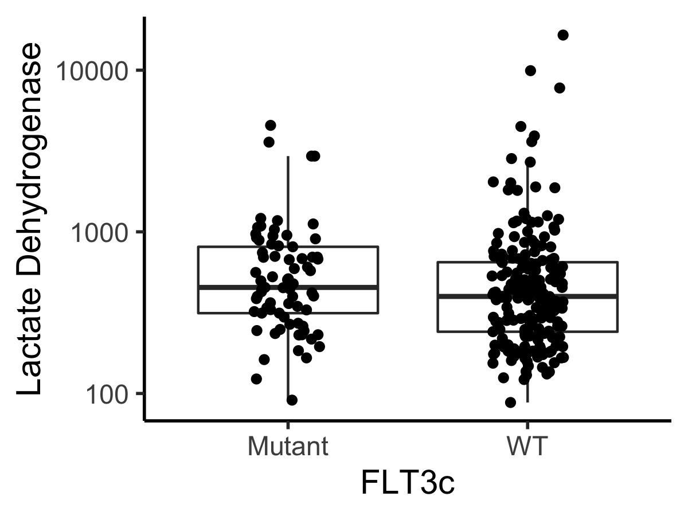
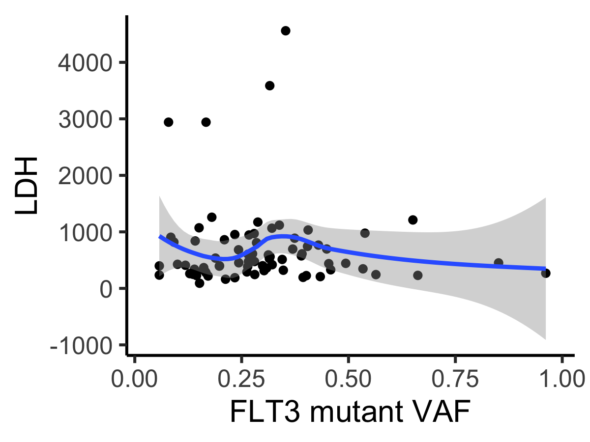
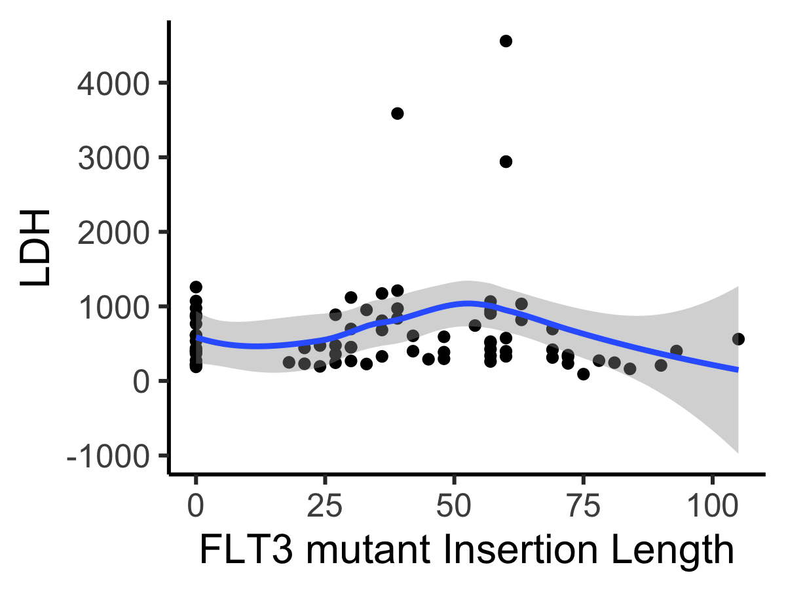
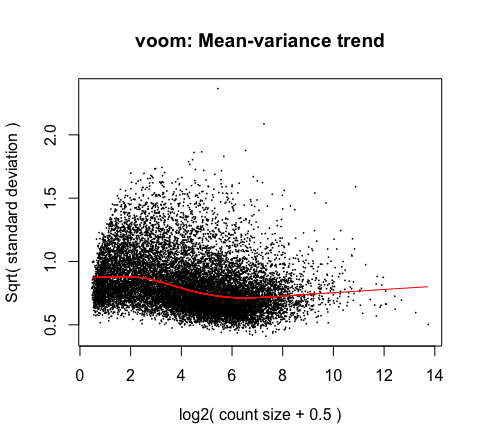

# AMLbeatR
AMLbeatR converts Beat AML data in 
[Tyner et al, Functional genomic landscape of acute myeloid leukaemia,
*Nature* **562**, 526–531 (2018)](https://www.nature.com/articles/s41586-018-0623-z) into a list-column tibble,
described in Chapter 25 of [R4DS](https://r4ds.had.co.nz/).  

To install AMLbeatR use:  
```
devtools::install_github("radivot/AMLbeatR",subdir="AMLbeatR")
```

## Beat AML Data
To use AMLbeatR you must first download a [290 MB excel file](https://static-content.springer.com/esm/art%3A10.1038%2Fs41586-018-0623-z/MediaObjects/41586_2018_623_MOESM3_ESM.xlsx) and a [pdf](https://static-content.springer.com/esm/art%3A10.1038%2Fs41586-018-0623-z/MediaObjects/41586_2018_623_MOESM1_ESM.pdf) that summarizes the sheets/tables in it. Sheets/Tables 5 (clinical), 7 (variant) and 9 (expression) are used by AMLbeatR. Place the 290 MB file 41586_2018_623_MOESM3_ESM.xlsx in the folder ~/data/BeatAML where ~ is your home directory. Now run the following  and explore the tibble in the upper left panel of R Studio.

```
library(AMLbeatR)  #loads installed package AMLbeatR into memory 
mkBeatAML() #makes ~/data/BeatAML/BeatAML.Rdata containing clinical, variant, and expression tibbles
load("~/data/BeatAML/BeatAML.RData") #loads  clinical (clin), variant (v), and expression (cpm) tibbles  
d=mkListColTib(clin,v,cpm)  #make list column tibble d 
View(d)   #Rows are patients and data is a list column of dataframes where rows are multiple samples per patient.
D=d%>%unnest() #reverse nesting to get back to 672 samples being rows
View(D)
eids=names(cpm)[-c(1:2)] #451 RNAseq measurements
vids=unique(v$labId) #608 variant samples
int=intersect(eids,vids) #399 samples have RNA and DNA readouts
De=D%>%filter(lid%in%eids)
De=De%>%group_by(id)%>%nest() #411 patients have 451 RNAseqs
Dv=D%>%filter(lid%in%vids)
Dv=Dv%>%group_by(id)%>%nest() #519 patients have 608 DNAseqs
intp=intersect(De$id,Dv$id) #376 patients have RNA and DNA reads 
``` 

## Example 1
It was recently [reported](https://www.ncbi.nlm.nih.gov/pubmed/29665898) 
that Lactate Dehydrogenase levels in the plasma are higher in AML patients with FLT3-ITD mutations. Using only data 
in the clinical data tibble clin the following code shows minimal differences


```
D=d%>%unnest()%>%filter(!is.na(FLT3c))
table(D$FLT3c,useNA="always")
D$FLT3c=c("WT","Mutant")[D$FLT3c+1]
tc=function(sz) theme_classic(base_size=sz);
D%>%ggplot(aes(x=FLT3c,y=LDH))+scale_y_log10()+geom_boxplot(alpha=0)+geom_jitter(width=.15)+
  ylab("Lactate Dehydrogenase")+tc(14)
ggsave("~/Results/AML/LdhFLT3C.png",width=4,height=3)
wilcox.test(D$LDH~D$FLT3c) #P=0.06
t.test(log10(D$LDH)~D$FLT3c) #P=0.17
``` 

If we instead use FLT3 variant calls in v, P=0.005 signifance is reached. We conclude from this that the clinical data fields
FLT3c and NPM1c in clin should probably be ignored, as they appear to be ~10-fold more noisy in terms of P values. 


```
sv=v%>%mutate(sym=ifelse(symbol=="FLT3","Mutant","WT"))%>%select(lid=labId,sym)
sv=sv%>%group_by(lid)%>%nest()
getM=function(x) sum(str_detect(x$sym,"Mutant"))>0 
sv=sv%>%mutate(State=map_lgl(data,getM))%>%select(-data)
sv$State=c("WT","Mutant")[sv$State+1]
D=left_join(D,sv)
D=D%>%filter(!is.na(State))
D%>%ggplot(aes(x=State,y=LDH))+scale_y_log10()+geom_boxplot(alpha=0)+geom_jitter(width=.15)+
  ylab("Lactate Dehydrogenase")+tc(14)
ggsave("~/Results/AML/LdhFLT3.png",width=4,height=3)
wilcox.test(D$LDH~D$State) #P=0.004963
t.test(log10(D$LDH)~D$State) #0.02673
```

The next question is, within FLT3 mutants called by v, is there a correlation between LDH and VAF? 



```
head(v,3)
sv=v%>%filter(symbol=="FLT3")%>%select(lid=labId,t_vaf,ref,alt)%>%mutate(insLen=str_length(alt)-str_length(ref))
head(sv)
table(sv$insLen) #all in frame as expected. 
# Now focus on biggest clones and insertions
sv=sv%>%group_by(lid)%>%summarize(vaf=max(t_vaf,na.rm=T),insLen=max(insLen,na.rm=T))
D=d%>%unnest()
D=left_join(D,sv)
gx=xlab("FLT3 mutant VAF")
D%>%filter(!is.na(vaf))%>%ggplot(aes(x=vaf,y=LDH))+gx+tc(15)+geom_point()+geom_smooth(method="loess")
ggsave("~/Results/AML/LdhFLT3vaf.png",width=4,height=3)
summary(lm(expr~vaf,data=D%>%filter(vaf>0))) # P = 0.000635
```

Finally, what about LDH and insertion length? 

```
gx=xlab("FLT3 mutant Insertion Length")
D%>%filter(!is.na(insLen),!is.na(LDH))%>%ggplot(aes(x=insLen,y=LDH))+gx+tc(15)+geom_point()+geom_smooth(method="loess")
ggsave("~/Results/AML/LdhFLT3insLen.png",width=4,height=3)
```

## Example 2
It was recently [reported](https://www.nejm.org/doi/full/10.1056/NEJMoa1516192) 
that among the four combinations of DNMT3A and NPM1 mutations, FLT3 mutations change survival 
the most when DNMT3A and NPM1 are both mutated. This result is replicated nicely below.

```
###### Survival
library(survival);library(survminer)
sv=v%>%filter(symbol%in%c("FLT3","DNMT3A","NPM1"))%>%select(lid=labId,sym=symbol,t_vaf)
sv=sv%>%group_by(lid,sym)%>%summarize(vaf=max(t_vaf,na.rm=T))
(sv=sv%>%mutate(sym=str_sub(sym,1,1)))
sv=sv%>%group_by(lid)%>%nest()
sv=sv%>%mutate(State=map(data,function(x) str_c(x$sym,collapse="")))%>%select(-data)
sv=sv%>%unnest()
D=d%>%unnest()
D=left_join(D,sv)
D=D%>%group_by(id,surv,status)%>%nest()
getLong=function(x) x$State[str_length(x$State)==max(str_length(x$State))]
getFirst=function(x) x[1]
D=D%>%mutate(State=map(data,getLong))%>%select(-data)
D=D%>%mutate(State1=map(State,getFirst))%>%select(-State)
D=D%>%unnest()
D=D%>%mutate(surv=surv/365.25) # make in Years
D$State1[is.na(D$State1)]="WT"
D1=D%>%filter(State1%in%c("WT","F"))
D2=D%>%filter(State1%in%c("D","DF"))
D3=D%>%filter(State1%in%c("N","FN"))
D4=D%>%filter(State1%in%c("DN","DFN"))
D1$grp="None"; D2$grp="D"; D3$grp="N"; D4$grp="DN";
D=bind_rows(D1,D2,D3,D4)
labs=c("Fwt","Fmut")
D$F=labs[str_detect(D$State1,"F")+1]
D=as.data.frame(D) #fixes survplot error 
D$grp=factor(D$grp,c("None","D","N","DN"))
D$F=factor(D$F,c("Fwt","Fmut"))
fit=survfit(Surv(surv,status)~F,data=D)

sbb=theme(strip.background=element_blank())
gy=ylab("Survival Probability")
gx=xlab("Years")
svts=scale_x_continuous(breaks=c(0,2,4,6,8,10))#surv times
lg=theme(legend.margin=margin(0,0,0,0),legend.position=c(0.9,0.85))#,legend.direction="horizontal")
ggsurvplot_facet(fit,D,legend.title="",facet.by="grp",nrow=1,short.panel.labs=T,
                 xlim=c(0,10),pval=T,pval.coord=c(3,0.45))+svts+sbb+gy+gx+lg
ggsave("~/Results/AML/survALL.png",width=7,height=3)
```


One might then wish to know which genes are most differentially expressed in DN with F wt vs mutated.

```

###### Differential Gene Expression 
library(Biobase)
library(limma)
sv=v%>%filter(symbol%in%c("FLT3","DNMT3A","NPM1"))%>%select(lid=labId,sym=symbol,t_vaf)
sv=sv%>%group_by(lid,sym)%>%summarize(vaf=max(t_vaf,na.rm=T))
(sv=sv%>%mutate(sym=str_sub(sym,1,1)))
sv=sv%>%group_by(lid)%>%nest()
sv=sv%>%mutate(State=map(data,function(x) str_c(x$sym,collapse="")))%>%select(-data)
sv=sv%>%unnest()
sv=sv%>%filter(State%in%c("DN","DFN"))  #66 have DN or DFN statue
eids=names(cpm)[-c(1:2)] #451 RNAseq measurements
int=intersect(eids,sv$lid) #40 with DN status have GE
sv=sv%>%filter(lid%in%int)
D=d%>%unnest()
D=D%>%filter(lid%in%int)%>%arrange(id) # 1246 254; 1532 424; 2538 261 days later
meta=cpm[names(cpm)[1:2]]
expr=as.matrix(cpm[int])
pD=data.frame(sv)
head(meta)
rownames(expr)=meta[,2]
eset=ExpressionSet(assayData=expr)
I=apply(expr,1,median)
I=I>1
eset=eset[I,]
eset
rownames(pD)=int
pD$State=factor(pD$State,c("DN","DFN"))
pData(eset)=pD
(design=model.matrix(~pD$State))
v <- voom(eset,design,plot=TRUE,normalize="quantile")
fit <- lmFit(v,design)
efitM <- eBayes(fit)
tb=topTable(efitM, coef=2, adjust="BH",number=2000)
head(tb,10)

             logFC  AveExpr        t      P.Value   adj.P.Val        B
ALDH2     2.821242 3.724876 6.428361 9.989863e-08 0.001191195 7.307082
CFH       3.594912 2.902327 6.277209 1.644615e-07 0.001191195 6.845075
SOCS2-AS1 3.078177 1.679220 6.016503 3.887055e-07 0.001876929 5.982933
MAGED1    1.573360 5.906167 5.879442 6.108073e-07 0.002212039 5.951419
C10orf128 2.752168 2.680110 5.481284 2.262538e-06 0.006555025 4.532447
APOL4     2.855428 1.773715 5.383254 3.119253e-06 0.007530917 4.203965
FAM92A1P1 1.414314 1.202226 5.312485 3.931300e-06 0.008135545 3.967188
SOCS2     3.528358 4.205840 5.229939 5.146555e-06 0.008283666 3.881300
FAM92A1   1.643208 2.368172 5.237830 5.015865e-06 0.008283666 3.792786
FAM124A   1.905130 1.840115 5.181353 6.029025e-06 0.008733646 3.614365
```


