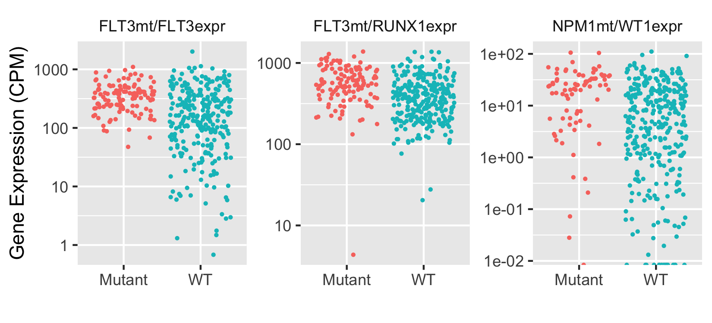

# AMLbeatR
An R package for analyses of  Beat AML data in
[Tyner et al, *Nature* **562**, 526–531 (2018)](https://www.nature.com/articles/s41586-018-0623-z).  

To install it use:  
```
devtools::install_github("radivot/AMLbeatR",subdir="AMLbeatR")
```

## Beat AML Data
Place the 290 MB file  [41586_2018_623_MOESM3_ESM.xlsx ](https://static-content.springer.com/esm/art%3A10.1038%2Fs41586-018-0623-z/MediaObjects/41586_2018_623_MOESM3_ESM.xlsx) in ~/data/BeatAML where ~ is your home directory and run  

```
rm(list=ls()) 
library(tidyverse)
library(AMLbeatR)  #loads installed package AMLbeatR into memory 
mkBeatAML() #Do only once (this takes some time). Makes ~/data/BeatAML/BeatAML.Rdata 
load("~/data/BeatAML/BeatAML.RData") #loads  clinical (clin), variant (v, av), and expression (rpkm, cpm) data  
(d=tidyClin(clin)) #672 rows in clin, one for each measurement; 562 rows in d, one for each patient
(d=muts(d,v,av,n=10)) # adds muts and vafs of top n genes and point mutation counts from all variants
attributes(d) # muts() also added some summary attributes
```

## Differentially Expressed Genes
To create an excel file with 10 sheets of differentially expressed genes, one for each mutated gene, run
```
geXL(d,v,cpm,f="~/Results/AML/topGE.xlsx") #WT vs mut differential gene expression (ge), one per mutated gene
``` 

## Low Gene Expression correlations with mutations

The following code generates an excel file (default=~/Results/AML/geQrtMutCorXL.xlsx) with odds ratios
and P values of correlations between a gene (sheet name) having low expression (1st vs 4th quartile) and another gene (row in a sheet) being mutated. Thus, if you are looking for a gene that, when mutated, mimics TP53 deletion to the extent that it lowers TP53 expression, you can guess from the output below (equal to  sheet "TP53" in the excel file) that SRSF2 is such a gene. The output also shows that FLT3 and NPM1 mutations arise more often when TP53 is not low. 

```
L=geQrtMutCorXL(d,v,cpm)
L$TP53
> L$TP53
# A tibble: 14 x 4
   genes         P    OR ORci              
   <chr>     <dbl> <dbl> <chr>             
 1 SRSF2  0.000841 5.82  5.82 (1.86, 24.25)
 2 FLT3   0.00259  0.401 0.4  (0.21, 0.74)  
 3 NPM1   0.00462  0.360 0.36 (0.17, 0.75) 
 4 ASXL1  0.106    2.93  2.93 (0.83, 13)   
 5 RUNX1  0.218    1.82  1.82 (0.74, 4.68) 
 6 TP53   0.241    1.96  1.96 (0.69, 6.06) 
 7 IDH2   0.313    1.64  1.64 (0.68, 4.08) 
 8 DNMT3A 0.506    0.758 0.76 (0.37, 1.53) 
 9 PTPN11 0.539    0.557 0.56 (0.12, 2.27) 
10 SF3B1  0.748    1.53  1.53 (0.35, 7.56) 
11 TET2   1        1.07  1.07 (0.48, 2.42) 
12 NRAS   1        1.08  1.08 (0.46, 2.56) 
13 IDH1   1        1.12  1.12 (0.39, 3.26) 
14 WT1    1        1     1    (0.34, 2.97)  
```


Scanning the excel sheets, the three most significant (P<1e-8) mutation-expression combinations is plotted below.


```
genesE=c("FLT3","RUNX1","WT1")
genesM=c("FLT3","FLT3","NPM1")
L=map2(genesE,geneM,function(x,y) getExpr(x,y,v,cpm))
names(L)=genes=paste0(genesM,"mt/",genesE,"expr")
for (i in genes) L[[i]]$genes=i
dd=bind_rows(L)
gx=xlab("")
sbb=theme(strip.background=element_blank())
ltp=theme(legend.position="none")
sy=scale_y_log10()
dd%>%ggplot(aes(x=State,y=E,color=State))+geom_jitter(size=0.5)+gy+gx+sbb+ltp+sy+facet_wrap(~genes,scales="free")
ggsave("~/Results/AML/jitter3.png",width=5.5,height=2)
```

## Survival
An independent group recently [reported](https://www.nejm.org/doi/full/10.1056/NEJMoa1516192) 
that among the four combinations of DNMT3A (D) and NPM1 (N) mutations, FLT3 (F) mutations change survival 
the most when D and N are both mutated. This result is replicated nicely below.


```
###### Survival
library(survival);library(survminer)
sv=v%>%filter(symbol%in%c("FLT3","DNMT3A","NPM1"))%>%select(lid=labId,sym=symbol,t_vaf)
sv=sv%>%group_by(lid,sym)%>%summarize(vaf=max(t_vaf,na.rm=T))
(sv=sv%>%mutate(sym=str_sub(sym,1,1)))
sv=sv%>%group_by(lid)%>%nest()
sv=sv%>%mutate(State=map(data,function(x) str_c(x$sym,collapse="")))%>%select(-data)
sv=sv%>%unnest()
D=left_join(d,sv)
D=D%>%group_by(id,surv,status)%>%nest()
getLong=function(x) x$State[str_length(x$State)==max(str_length(x$State))]
getFirst=function(x) x[1]
D=D%>%mutate(State=map(data,getLong))%>%select(-data)
D=D%>%mutate(State1=map(State,getFirst))%>%select(-State)
D=D%>%unnest()
D=D%>%mutate(surv=surv/365.25) # make in Years
D$State1[is.na(D$State1)]="WT"
D1=D%>%filter(State1%in%c("WT","F"))
D2=D%>%filter(State1%in%c("D","DF"))
D3=D%>%filter(State1%in%c("N","FN"))
D4=D%>%filter(State1%in%c("DN","DFN"))
D1$grp="None"; D2$grp="D"; D3$grp="N"; D4$grp="DN";
D=bind_rows(D1,D2,D3,D4)
labs=c("Fwt","Fmut")
D$F=labs[str_detect(D$State1,"F")+1]
D=as.data.frame(D) #fixes survplot error 
D$grp=factor(D$grp,c("None","D","N","DN"))
D$F=factor(D$F,c("Fwt","Fmut"))
fit=survfit(Surv(surv,status)~F,data=D)

sbb=theme(strip.background=element_blank())
gy=ylab("Survival Probability")
gx=xlab("Years")
svts=scale_x_continuous(breaks=c(0,2,4,6,8,10))#surv times
lg=theme(legend.margin=margin(0,0,0,0),legend.position=c(0.9,0.85))#,legend.direction="horizontal")
ggsurvplot_facet(fit,D,legend.title="",facet.by="grp",nrow=1,short.panel.labs=T,
                 xlim=c(0,10),pval=T,pval.coord=c(3,0.45))+svts+sbb+gy+gx+lg
ggsave("~/Results/AML/survALL.pdf",width=10,height=3)
ggsave("~/Results/AML/survALL.png",width=7,height=3)
```

